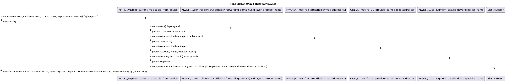
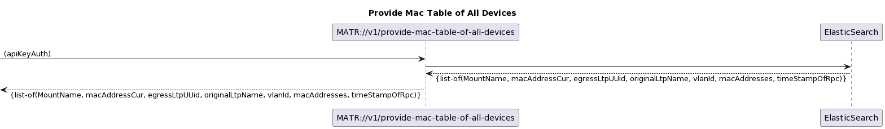
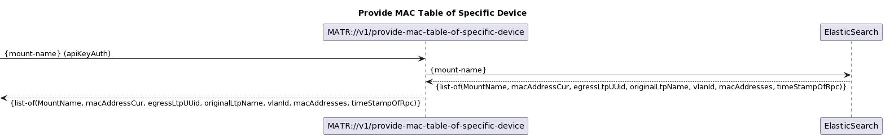
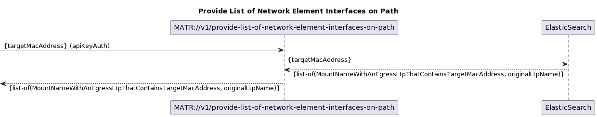
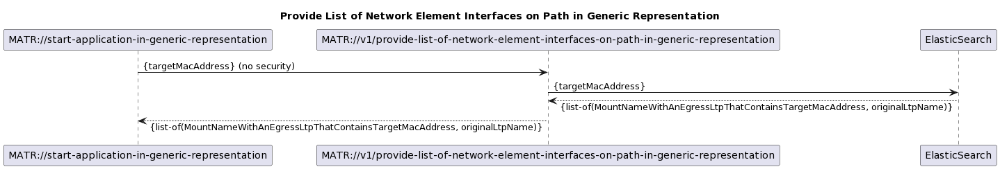

# MacAddressTableRecorder Specification

The cyclic operation for collecting the MAC address table from the devices is started as a part of the embedding process.  
Please note that the required connections to RegistryOffice, MicrowaveDeviceInventory and MacAddressTableRecorder itself must first be approved in the ApplicationLayerTopology before the cyclic operation can be successfully started.  
This requires multiple embedding initiations.  
  
The cyclic operation does not implement its own reading on the devices, but only calling the operation MATR://v1/read-current-mac-table-from-device.  

 .  

The MATR://v1/read-current-mac-table-from-device operation can be called by another application or by the MATR itself as a part of the cyclic operation.  
Either way, it stores the collected information in its own ElasticSearch database.  
If the requestor provides its own IP address, TCP port and a ServiceName in the requestBody, MATR://v1/read-current-mac-table-from-device sends a request containing the desired MAC table to that address after it has finished collecting the required data.  
This answer is identified by the same requestID that has already been sent in the responseBody of the initiating request.  
  

.  

The four offered services  
 - /v1/provide-mac-table-of-all-devices  
 - /v1/provide-mac-table-of-specific-device  
 - /v1/provide-list-of-network-element-interfaces-on-path  
 - /v1/provide-list-of-network-element-interfaces-on-path-in-generic-representation  

get served with data from ElasticSearch.  
Filtering should preferably be done on the database side.  
  
  

/v1/provide-mac-table-of-all-devices supports pagination.  

  
  

To facilitate consumption from within GenericRepresentation the /v1/provide-list-of-network-element-interfaces-on-path-in-generic-representation operation must be provided without any security.  

.  

### ServiceList
- [MacAddressTableRecorder+services](./MacAddressTableRecorder+services.yaml)

### ProfileList and ProfileInstanceList
- [MacAddressTableRecorder+profiles](./MacAddressTableRecorder+profiles.yaml)
- [MacAddressTableRecorder+profileInstances](./MacAddressTableRecorder+profileInstances.yaml)

### ForwardingList
- [MacAddressTableRecorder+forwardings](./MacAddressTableRecorder+forwardings.yaml)

### Open API specification (Swagger)
- [MacAddressTableRecorder](./MacAddressTableRecorder.yaml)

### CONFIGfile (JSON)
- [MacAddressTableRecorder+config](./MacAddressTableRecorder+config.json)

### Comments
- ./.
