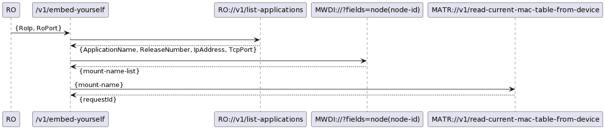
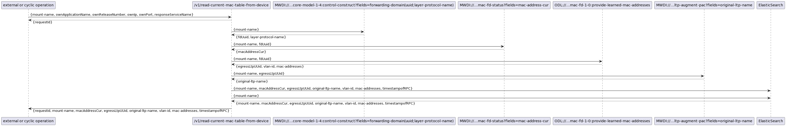
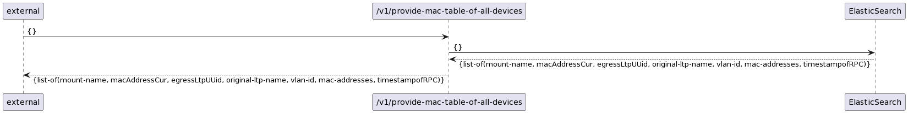
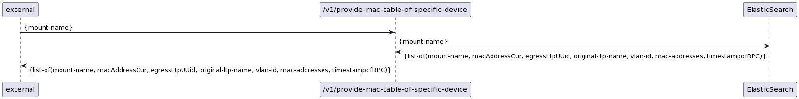
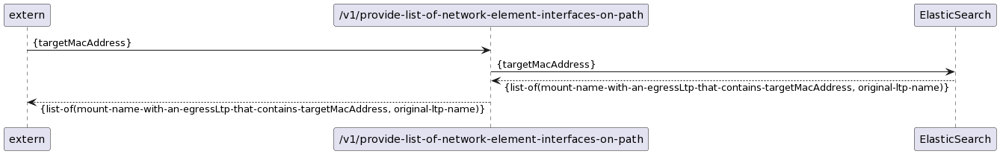
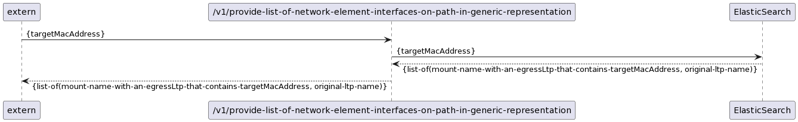

# Diagrams

### Forwardings  

**Cyclic Operation:**  
  

**Read MAC Table from Device:**  
  

**Provide MAC Tables of all Devices from Database:**  
  

**Provide MAC Table of specific Device from Database:**  
  

**Provide List of Interfaces on Path to MAC Address:**  
  

**Provide List of Interfaces on Path to MAC Address in generic representation:**  
  
